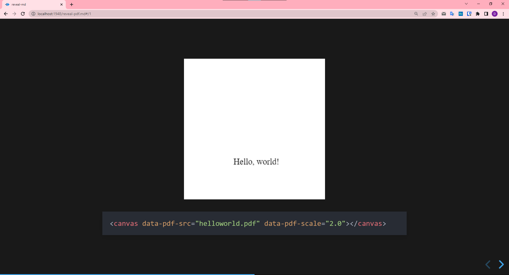

# reveal-pdf

[ ](https://www.npmjs.com/package/reveal-pdf) 
[](https://github.com/dvirtz/reveal-pdf/actions?query=workflow%3ARelease)

A [reveal.js](https://revealjs.com/) plugin for viewing PDF page as image:



Check out the live [demo](https://dvirtz.github.io/reveal-pdf/).

The images are generated using [pdf.js](https://mozilla.github.io/pdf.js//).

---

## Installation

1. Download and install the package in your project:

    ```
    npm install --save reveal-pdf
    ```

    or

    ```
    yarn add reveal-pdf
    ```

    or just download [dist/reveal-pdf.js](/packages/reveal-pdf/dist/reveal-pdf.js) into the plugin folder of your reveal.js presentation, e.g.. `plugins/reveal-pdf`.

2. Add the plugins to the dependencies in your presentation

    ```html
    <script src="node_modules/reveal-pdf/dist/reveal-pdf.js"></script>
    ```

    ```javascript
    // ...
    Reveal.initialize({
      // ...
      plugins: [
          // ...
          RevealPdf,
      ]
    });
    ```

    If you're using [reveal-md](https://github.com/webpro/reveal-md) you can add a script to load the plugin:

    ```js
    options.plugins.push(RevealPdf)
    ```

    and then add a reference to this script along with `node_modules/reveal-pdf/dist/timeline.js` to the `scripts` object inside `reveal-md.json` config file. 

For reference, take a look at the [demo](/packages/reveal-pdf-demo) package in this repo.
